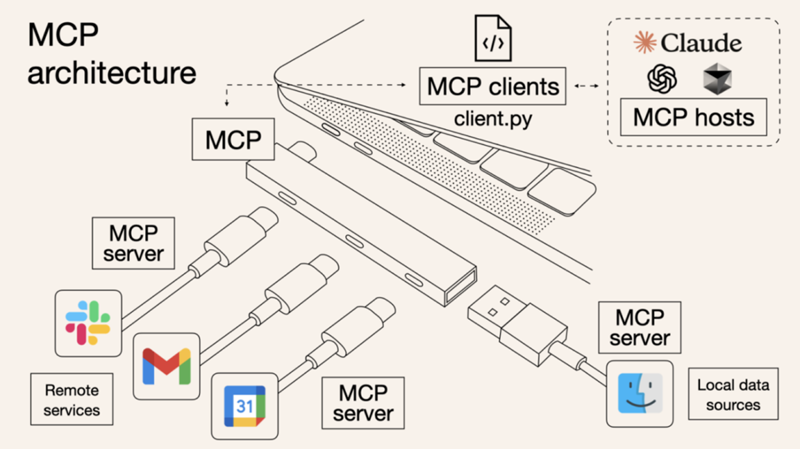
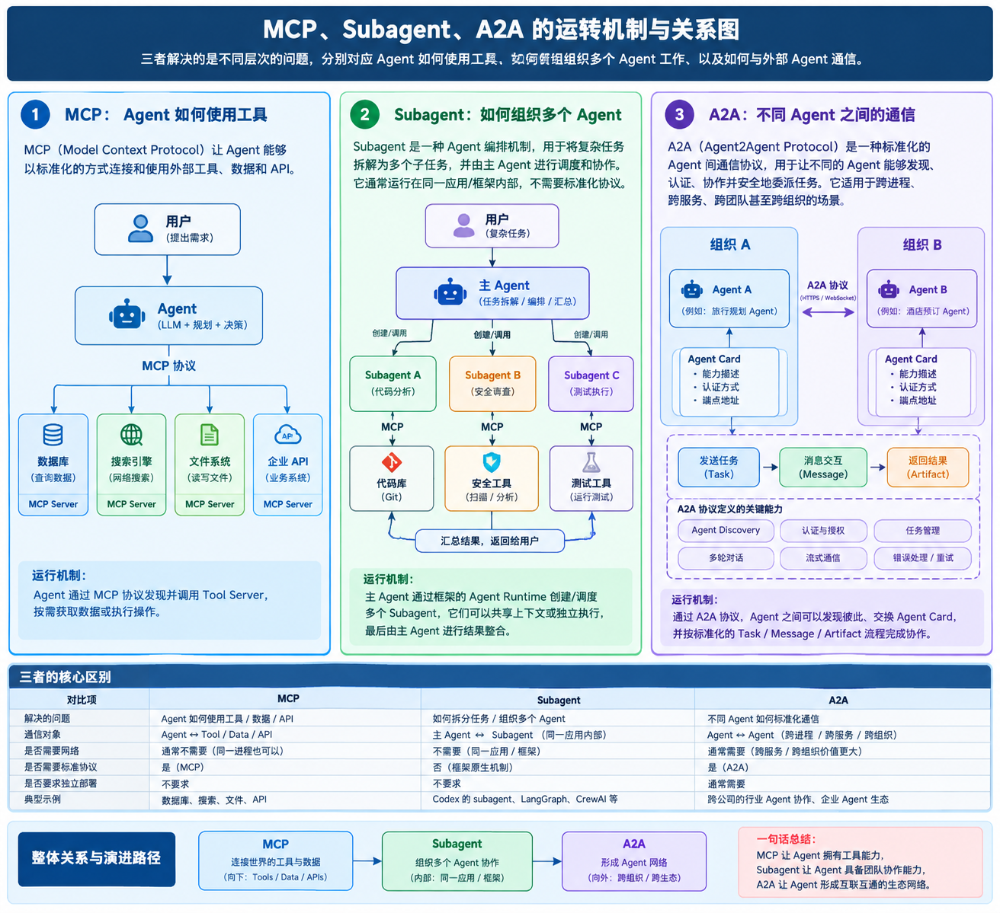

# A2A（Agent2Agent）协议学习报告

> **说明**：本文面向需要理解 A2A 协议原理、核心组件与工程实现的技术人员，重点从“为什么需要 A2A、A2A 是什么、如何工作、如何实现，以及与 MCP 和 Subagent 的关系”五个层次展开。本文中的协议定义与工程描述以 A2A 官方规范及官方 Python SDK 为主要依据。

---

# 第1章 A2A 协议的提出背景：Why

## 1.1 从单 Agent 到 Agent 协作：为什么需要 A2A

早期的 Agent 应用通常采用“**单 Agent + Tools**”的架构。用户向 Agent 提出任务，Agent 通过大模型进行推理，根据需要调用搜索、数据库、文件系统、企业 API 等外部工具，最终完成任务。在这种架构中，Agent 与外部能力之间的连接可以通过 MCP 等协议进行标准化。

但是，随着 Agent 能力不断增强，系统开始出现另一类需求：**一个 Agent 不仅需要调用工具，还需要调用另一个具有独立能力的 Agent。**

例如，一个旅游规划 Agent 收到“帮我制定一份东京旅行计划”的请求后，可能需要：

- 向航班 Agent 查询航班；
    
- 向酒店 Agent 查询住宿；
    
- 向景点 Agent 查询景点；
    
- 向支付 Agent 完成支付；
    
- 向企业内部审批 Agent 发起审批。
    

这些对象并不一定是传统意义上的 Tool。它们可能本身就是具有独立推理、任务规划、工具调用和状态管理能力的 Agent。

于是，系统关系开始从：

```text
User
  ↓
Agent
  ↓
Tool
```

逐渐扩展为：

```text
                 ┌── Tool
                 │
User → Agent ────┼── Database
                 │
                 ├── API
                 │
                 └── Other Agent
```

问题也随之发生变化。

如果 Agent A 与 Agent B 都由同一个团队、同一个框架构建，可以直接采用框架内部定义的通信方式。但如果：

- Agent A 和 Agent B 使用不同开发框架；
    
- Agent A 和 Agent B 由不同团队开发；
    
- Agent A 和 Agent B 独立部署；
    
- Agent A 不知道 Agent B 的内部实现；
    
- Agent A 和 Agent B 甚至属于不同组织；
    

那么，仅依靠具体框架的内部接口就很难形成通用的互操作机制。

因此，A2A 所要解决的核心问题可以概括为：

> **当 Agent 开始成为其他 Agent 的协作对象时，不同 Agent 之间如何在不了解彼此内部实现的情况下进行标准化通信和任务协作？**

A2A 官方定位正是通过开放协议，使独立、通常内部状态不透明的 Agent 能够发现彼此、协商交互方式、管理任务并交换消息和复杂数据。

### A2A 主要试图解决的问题

可以将这一需求归纳为四个方面：

**第一，Agent Discovery。**

Agent 首先需要知道“有哪些 Agent 可以帮助我”，以及“这个 Agent 能够做什么”。

**第二，Capability Discovery。**

发现 Agent 之后，还需要了解它支持哪些能力、输入输出形式以及交互方式。

**第三，Task Delegation。**

Agent 需要能够将一个具体任务委托给另一个 Agent，而不仅仅是调用一个简单函数。

**第四，Result Exchange。**

远程 Agent 执行任务后，需要能够返回消息、任务状态以及复杂结果，例如文件、结构化数据或其他 Artifact。

因此，A2A 并不是为了规定 Agent 应该使用什么模型、如何进行推理，而是为**Agent 之间的互操作**提供统一的通信规则。

---

# 第2章 A2A 是什么：What

## 2.1 A2A 的定义

A2A，即 **Agent2Agent Protocol**，是一种用于实现不同 AI Agent 之间互操作与协作的开放协议。

从功能定位来看，A2A 解决的是：

> **不同 Agent 如何发现彼此、建立通信、委托任务、交换消息以及返回结果。**

A2A 并不规定：

- Agent 必须使用哪一种大语言模型；
    
- Agent 必须使用哪一种 Agent Framework；
    
- Agent 内部必须采用哪一种 Prompt；
    
- Agent 必须如何进行规划和推理；
    
- Agent 必须使用哪些工具。
    

换言之，A2A 关注的是 **Agent 的外部协作接口**，而不是 Agent 的内部实现。

---

## 2.2 A2A 的核心思想

A2A 可以用三个关键词概括：

> **Discovery → Communication → Collaboration**

即：

```text
发现 Agent
    ↓
了解 Agent 能做什么
    ↓
建立标准化通信
    ↓
委托任务
    ↓
Agent 执行任务
    ↓
返回结果 / Artifact
```

其中：

### Discovery：发现

Client Agent 首先需要找到目标 Agent，并获取其 Agent Card。

Agent Card 可以理解为 Agent 对外公开的能力和连接信息。

### Communication：通信

两个 Agent 建立通信后，需要采用统一的数据结构传递消息、任务以及状态信息。

### Collaboration：协作

通信的最终目的并不是简单地“发送一条消息”，而是让一个 Agent 能够将任务交给另一个 Agent，并获得可持续管理的任务结果。

因此，A2A 与传统的简单 API 调用存在明显区别。

```text
API 调用：

调用函数
  ↓
得到结果


A2A：

发现 Agent
  ↓
了解能力
  ↓
发送任务
  ↓
任务执行
  ↓
状态变化
  ↓
消息 / Artifact
  ↓
任务完成
```

A2A 的设计重点因此从简单的“请求—响应”扩展到了**Agent 任务生命周期管理**。

---

# 第3章 A2A 的整体架构与核心组件

## 3.1 A2A 整体架构

一个典型的 A2A 系统至少包含两个逻辑角色：

- **Client Agent**：发起协作的一方；
    
- **Remote Agent**：提供能力、接受任务的一方。
    

需要注意，Client Agent 和 Remote Agent 都可以是完整的 AI Agent。

因此：

> Client 和 Remote 描述的是当前一次通信中的角色，而不是两种不同类型的 Agent。

同一个 Agent 在一次任务中可能作为 Client，在另一项任务中又可以作为 Remote Agent。

整体关系可以表示为：

```text
                  A2A Protocol
                       │
        ┌──────────────┴──────────────┐
        │                             │
  Client Agent                  Remote Agent
        │                             │
        │       Message / Task        │
        └─────────────────────────────┘
                       │
                   Artifact
```

A2A Server 则负责对外提供 Agent 的 A2A 服务接口，并处理来自 Client Agent 的协议请求。

---

## 3.2 Agent Card

Agent Card 是 A2A 中非常重要的概念。

官方规范要求 A2A Server 提供 Agent Card，用于描述 Agent 的身份、能力、Skills 以及交互要求，Client 可以通过 Agent Card 发现合适的 Agent 并据此配置后续交互。

可以将 Agent Card 理解为：

> **Agent 对外公开的“能力说明书 + 连接说明书”。**

它通常需要描述：

- Agent 名称；
    
- Agent 描述；
    
- Agent 支持的接口；
    
- 协议绑定；
    
- 协议版本；
    
- Agent 能力；
    
- Agent Skills；
    
- 默认输入模式；
    
- 默认输出模式；
    
- 安全要求；
    
- 其他扩展信息。
    

例如：

```text
Agent Card
│
├── Identity
│   ├── name
│   ├── description
│   └── version
│
├── Interface
│   ├── url
│   ├── protocol binding
│   └── protocol version
│
├── Capabilities
│   ├── streaming
│   └── push notification
│
├── Skills
│   ├── Skill A
│   ├── Skill B
│   └── Skill C
│
└── Security
    ├── authentication
    └── authorization
```

在 A2A 1.0 中，Agent Card 的接口描述已经进一步抽象为 `supportedInterfaces`，一个 Agent 可以声明多个协议接口，而不是只有一个简单的 URL。官方 Python SDK 的 0.3 → 1.0 迁移文档也明确记录了这一变化。

### Agent Card 如何被发现？

A2A 支持多种发现机制，包括：

- Well-Known URI；
    
- Agent Registry / Catalog；
    
- 直接配置 Agent Card。
    

标准的 Well-Known 路径为：

```text
/.well-known/agent-card.json
```

Client 可以访问：

```text
https://example.com/.well-known/agent-card.json
```

获取 Agent Card。

因此可以形成：

```text
Client Agent
     │
     │ GET
     ↓
/.well-known/agent-card.json
     │
     ↓
Agent Card
     │
     ├── Agent 是谁
     ├── 能做什么
     ├── 如何连接
     └── 如何认证
```

---

## 3.3 Agent Interface 与 Agent Skill

### Agent Interface

Agent Interface 解决的是：

> **“我应该通过什么方式与你通信？”**

它描述一个 Agent 支持的通信接口，例如：

```text
AgentInterface
├── url
├── protocol_binding
└── protocol_version
```

因此一个 Agent 可以同时支持不同的通信方式。

例如：

```text
Agent Card
    │
    └── supportedInterfaces
          ├── JSON-RPC
          ├── gRPC
          └── HTTP/JSON
```

这体现了 A2A 对不同传输和协议绑定方式的兼容能力。官方 Python SDK 1.0 迁移文档明确将原来的单一 `url` 结构调整为 `supported_interfaces` 列表。

### Agent Skill

Agent Skill 解决的是：

> **“我能够帮你完成什么任务？”**

例如一个旅行 Agent：

```text
Agent Skill
├── 查询航班
├── 查询酒店
├── 制定旅行计划
└── 推荐景点
```

Skill 通常会描述：

- Skill ID；
    
- Skill 名称；
    
- Skill 描述；
    
- Tags；
    
- 输入模式；
    
- 输出模式；
    
- 示例。
    

因此：

```text
Agent Interface
    ↓
告诉别人“怎么找我、怎么和我通信”

Agent Skill
    ↓
告诉别人“我能帮你做什么”
```

---

## 3.4 Message、Part 与 Task

A2A 并不是简单地定义一个字符串请求。

它建立了一套更加完整的任务与消息模型。

基本关系可以抽象为：

```text
Task
├── Message
│    └── Part
│         ├── Text
│         ├── File
│         └── Data
│
└── Artifact
```

### Message

Message 表示 Agent 之间交换的信息。

例如：

```text
“请帮我查询明天北京到上海的航班。”
```

它可以是 Client Agent 发给 Remote Agent 的请求，也可以是 Remote Agent 返回的信息。

### Part

Part 是消息中的具体内容单元。

它可以承载不同类型的数据，例如：

```text
Message
├── Text
├── File
└── Structured Data
```

这样 A2A 就不局限于纯文本对话。

### Task

Task 是 A2A 中非常关键的抽象。

它代表：

> **一个需要被执行、跟踪并最终完成或失败的任务。**

例如：

```text
Task
ID: task-001

状态：
submitted
   ↓
working
   ↓
completed
```

也可能：

```text
submitted
   ↓
working
   ↓
failed
```

因此 Task 与简单的函数调用有重要区别。

函数调用通常关注：

```text
Input → Output
```

而 Task 更关注：

```text
任务创建
  ↓
任务执行
  ↓
任务状态
  ↓
任务更新
  ↓
任务完成
```

### Artifact

Artifact 表示 Agent 在执行任务过程中产生的结果。

例如：

- 一份报告；
    
- 一个文件；
    
- 一张图片；
    

因此：

> **Message 更偏向“通信内容”，Task 更偏向“任务生命周期”，Artifact 更偏向“任务产生的结果”。**

---

## 3.5 Streaming、Push Notification 与 Authentication

真实生产环境中的 Agent 任务可能需要较长时间，因此 A2A 并不只支持简单的同步交互。

### Streaming

Streaming 允许 Client 在任务执行过程中持续获得更新。

例如：

```text
Client
  │
  │ Send Task
  ↓
Remote Agent
  │
  ├── Status: working
  ├── Progress Update
  ├── Partial Result
  ├── Artifact Update
  └── Status: completed
```

这对于长时间运行的任务尤其重要。

### Push Notification

对于异步任务，Client 不一定需要持续保持连接等待结果。

Remote Agent 可以在任务状态发生变化或任务完成后，通过 Push Notification 通知 Client。

因此：

```text
同步：

Client ───── Request ─────→ Agent
Client ←──── Response ───── Agent


异步：

Client ───── Task ─────→ Agent

Client
  │
  │ 可以继续执行其他工作
  │
  ↓

Agent 完成任务
  │
  ↓
Push Notification
  │
  ↓
Client
```

### Authentication

跨 Agent 通信往往意味着跨服务、跨团队甚至跨组织，因此身份认证和访问控制是 A2A 工程实现中的重要组成部分。

其目标是解决：

> **“你是谁？”、“你是否有权调用我？”以及“这次通信是否可信？”**

---

# 第4章 A2A 是如何运行的：How

A2A 的基本运行过程可以概括为：Client Agent 首先通过 Agent Card 发现 Remote Agent，并了解其能力、Skill、通信接口以及安全要求；随后 Client Agent 根据用户任务选择合适的 Remote Agent，通过 A2A 协议发送 Message 或创建 Task；Remote Agent 接收任务后执行相应工作，并根据任务执行情况持续更新 Task 状态；执行过程中可以通过 Streaming 返回实时信息，也可以通过 Push Notification 处理异步任务；最终 Remote Agent 通过 Message 或 Artifact 返回任务结果。整个过程形成“**发现 → 能力确认 → 建立通信 → 创建任务 → 执行任务 → 返回结果**”的完整 Agent-to-Agent 协作链路。


---

# 第5章 A2A 的工程实现

## 5.1 A2A Python 工程结构与基本实现

从工程角度看，一个最小的 A2A Agent 通常需要完成几个核心工作：

```text
定义 Agent
    ↓
创建 Agent Card
    ↓
定义 Agent Skill
    ↓
实现 Agent Executor
    ↓
创建 Request Handler
    ↓
创建 A2A Server
    ↓
暴露 Agent Card
    ↓
提供 A2A 接口
```

A2A 官方 Python Quickstart 将开发过程拆分为 Agent Skills & Agent Card、Agent Executor、启动 Server、Client 交互等步骤。

### Agent Card

首先描述 Agent 对外提供的能力：

```python
skill = AgentSkill(
    id="hello_world",
    name="Hello World",
    description="Returns a Hello World message.",
    tags=["hello", "world"],
    examples=["hello world"],
)
```

然后创建 Agent Card：

```python
agent_card = AgentCard(
    name="Hello World Agent",
    description="A simple A2A agent",
    supported_interfaces=[
        AgentInterface(
            url="http://localhost:9999/",
            protocol_binding="JSONRPC",
            protocol_version="1.0",
        )
    ],
    version="1.0.0",
    default_input_modes=["text/plain"],
    default_output_modes=["text/plain"],
    skills=[skill],
)
```

这里的关键不是记住每一个字段，而是理解：

```text
Agent Card
     ↓
告诉外界：
“我是哪个 Agent”
“我能做什么”
“你应该如何连接我”
```

---

### Agent Executor

真正的业务逻辑通常由 Agent Executor 承担。

可以将它理解为：

> **A2A Server 收到任务之后，应该如何执行这个任务的业务逻辑。**

例如：

```text
A2A Request
     ↓
Request Handler
     ↓
Agent Executor
     ↓
Agent Logic / LLM / Tools
     ↓
Task / Message / Artifact
```

因此 A2A 协议本身并不会替 Agent 完成业务推理。

它负责的是：

```text
“如何通信”
```

而 Executor 负责：

```text
“收到任务以后具体做什么”
```

---

### Server

在 Python SDK 中，可以将 Request Handler、Agent Card 和路由组合起来形成 A2A Server。

当前官方 Python SDK 1.0 已采用路由工厂方式创建 JSON-RPC、REST 和 Agent Card 路由，而不再使用早期版本的部分 Application Wrapper。

典型结构可以抽象为：

```python
handler = DefaultRequestHandler(
    agent_executor=agent_executor,
    task_store=task_store,
    agent_card=agent_card,
)

routes = [
    create_agent_card_routes(...),
    create_jsonrpc_routes(...),
]
```

最终由 Web Server 对外提供服务。

因此，一个完整的 A2A Server 可以理解为：

```text
                  A2A Server
                      │
        ┌─────────────┼─────────────┐
        ↓             ↓             ↓
   Agent Card    Request Handler   Routes
                      │
                      ↓
               Agent Executor
                      │
                      ↓
              Agent Business Logic
```

---

### Client

Client Agent 需要完成的事情则相反：

```text
发现 Agent Card
      ↓
创建 A2A Client
      ↓
发送 Message / Task
      ↓
接收 Task / Message / Artifact
      ↓
处理结果
```

当前官方 Python SDK 提供了基于 Agent Server URL 或 Agent Card 创建 Client 的方式。

因此，从工程实现角度可以把 A2A 简化为：

```text
Server：

Agent Card
   +
Agent Executor
   +
Request Handler
   +
A2A Routes
   ↓
A2A Server


Client：

Agent Card
   ↓
A2A Client
   ↓
Message / Task
   ↓
Remote Agent
```

---

## 5.2 A2A 在实际系统中的部署形态

A2A Agent 通常可以作为独立服务部署。

例如：

```text
┌──────────────────────┐
│      Agent A         │
│                      │
│ LLM / Memory / Tools │
└──────────┬───────────┘
           │
        A2A Client
           │
           │ A2A
           ↓
┌──────────────────────┐
│      Agent B         │
│      A2A Server      │
│                      │
│ LLM / Planning       │
│ Tools / MCP          │
└──────────┬───────────┘
           │
           ↓
     MCP / API / DB
```

这体现出一个非常重要的分层关系：

> **A2A 解决 Agent 与 Agent 之间的通信，而 Agent 内部仍然可以使用 MCP、数据库、API、搜索系统等基础设施完成具体任务。**

例如：

```text
Agent A
   │
   │ A2A
   ↓
Agent B
   │
   │ MCP
   ↓
Tool / Database / API
```

因此，A2A 与 MCP 并不是简单的替代关系。

---

# 第6章 MCP、Subagent 与 A2A：三种机制的区别

## 6.1 三种机制的整体定位

在 Agent 系统中，MCP、Subagent 和 A2A 分别解决不同层面的问题：

|机制|主要解决的问题|典型关系|
|---|---|---|
|MCP|Agent 如何连接工具与数据|Agent → Tool|
|Subagent|一个 Agent 如何拆分和组织任务|Agent → Subagent|
|A2A|不同 Agent 如何标准化通信与协作|Agent → Agent|


---

## 6.2 MCP：Agent 与工具之间的连接机制

MCP 主要解决 Agent 与外部工具、数据和系统之间的标准化连接问题，使 Agent 能够发现并调用 Tool、读取 Resource 或使用其他 MCP 能力。它关注的是“Agent 如何使用外部能力”，核心关系可以概括为：

> **Agent → Tool / Data**

MCP 的基本思想是将外部能力标准化，使 Agent 不需要针对每一个工具设计完全不同的连接机制。



---

## 6.3 Subagent：Agent 内部的任务编排机制

Subagent 是一种 Agent 编排方式。

主 Agent 可以根据复杂任务进行拆解：

```text
用户任务
   ↓
Main Agent
   ├── Subagent A
   ├── Subagent B
   └── Subagent C
```

不同 Subagent 分别完成子任务，主 Agent 再对结果进行汇总。这种机制主要解决的是：

> **一个 Agent 系统内部如何组织多个 Agent 协同完成复杂任务。**

因此：

> **Subagent 的存在并不意味着系统使用了 A2A。**

一个系统完全可以在内部使用 Subagent，而不采用 A2A 协议。

---

## 6.4 A2A：独立 Agent 之间的标准化协作机制

A2A 主要解决不同 Agent 之间的标准化通信问题。

尤其是在以下情况下，A2A 的价值更加明显：

- 不同服务；
    
- 不同框架；
    
- 不同团队；
    
- 不同部署环境；
    
- 不同组织；
    
- 独立运行的 Agent。
    

A2A 通过 Agent Card、Message、Task、Artifact 等机制，使 Agent 能够进行能力发现、任务委托和结果交换。官方文档也明确将 A2A 定位为独立 Agent 之间的应用层通信与协作协议。

---

## 6.5 总结

MCP、Subagent 和 A2A 并不是相互排斥的技术。用一句话总结：

> **Subagent 负责内部协作，MCP 负责工具连接，A2A 负责 Agent 间协作。**

三者可以共同构成一个更加完整的 Agent 系统。


---

# 第7章 A2A 的生态与当前应用现状

A2A 已经形成了较完整的协议规范、SDK、示例和开发工具生态。例如官方项目已经提供 Python 等多语言 SDK、示例以及协议规范和测试相关资源；Python SDK 本身也支持异步开发，并提供 HTTP、gRPC 等相关能力。

但是，从实际开发者使用和公开应用案例的可见度来看，A2A 的应用密度仍然明显低于 MCP。其原因并不简单是“协议不成熟”，而是当前大量 Agent 应用仍然采用“单 Agent + Tool”的架构；即使需要多个 Agent，也经常直接使用某个 Agent Framework 内部的 Subagent、Workflow 或其他编排机制，而不需要跨服务、跨框架、跨组织进行标准化通信。

因此，A2A 当前存在一种比较明显的“**生态尴尬**”：

> **协议本身已经开始形成标准化生态，但真正需要跨 Agent 标准化通信的场景，还没有像 Tool Calling 那样普遍。**

## 7.1 当前 A2A 应用相对有限的主要原因

### 1. 单 Agent + Tool 仍是大量应用的主要架构

目前很多 AI 应用并不需要多个独立 Agent。

如果一个 Agent 通过 MCP 就可以完成：

```text
搜索
数据库查询
文件操作
API 调用
```

那么引入 A2A 并不会自动产生额外价值。

---

### 2. 很多 Multi-Agent 系统采用框架内部编排

Multi-Agent 并不等于 A2A。

一个框架完全可以在内部实现：

```text
Main Agent
   ↓
Subagent A
   ↓
Subagent B
```

这些 Agent 可以直接共享内部状态、调用框架 API 或通过内部消息机制通信。

在这种情况下，没有必要为了内部协作额外引入一个跨系统协议。

---

### 3. A2A 的价值通常出现在跨系统协作场景

当系统变成：

```text
企业 A Agent
       ↕
企业 B Agent
       ↕
企业 C Agent
```

或者：

```text
Framework A
      ↕
Framework B
      ↕
Framework C
```

A2A 的价值才会更加明显。

因为此时系统需要解决：

> “如何让不同实现的 Agent 互相理解和通信？”

---

### 4. Agent 本身仍处于快速演进阶段

A2A 要解决的是 Agent 之间的互操作问题，但“Agent”本身仍然处于快速演进阶段。

例如：

- Agent 是否应该长期运行？
    
- Agent 的能力如何标准化描述？
    
- Agent 的任务生命周期如何定义？
    
- Agent 如何建立信任？
    
- Agent 如何进行身份认证？
    
- Agent 如何保证结果可靠？
    

这些问题仍然在持续演进。

---

### 5. A2A 需要解决的问题比 Tool Calling 更复杂

Tool 通常具有比较明确的：

```text
Input
  ↓
Function
  ↓
Output
```

而 Agent 可能存在：

```text
Task
 ↓
Planning
 ↓
Execution
 ↓
Intermediate State
 ↓
Artifact
 ↓
Long-running Task
 ↓
Completion
```

因此 A2A 不仅要解决“怎么调用”，还要解决：

> **任务如何创建、执行、更新、暂停、完成以及返回复杂结果。**

---

### 6. A2A 存在网络效应问题

A2A 还存在一个典型的网络效应问题：

```text
Agent 少
   ↓
A2A 需求低
   ↓
A2A 部署少
   ↓
互操作 Agent 少
   ↓
A2A 需求进一步降低
```

只有当足够多的 Agent 愿意按照统一协议提供能力时，A2A 的网络价值才会真正体现出来。

---
### 总结

当前 A2A 仍面临 Agent Discovery、身份与信任、认证授权、任务可靠性、异步任务管理、可观测性、跨框架兼容以及生态网络效应等问题。其核心挑战并不只是“协议能不能通信”，而是当 Agent 数量真正形成网络后，如何解决“**找到谁、相信谁、如何协作、如何管理长期任务、如何保证结果可靠**”等工程问题。因此，A2A 当前更适合被理解为正在形成中的 Agent 互操作基础设施，而不是已经完全成熟的 Agent 网络基础设施。

---

# 第8章 讨论：A2A 会成为 Agent 世界的 HTTP 吗？

## 8.1 为什么会出现“Agent 世界的 HTTP”这个类比

HTTP 的成功，本质上解决了不同计算机、不同软件之间的标准化通信问题。

在互联网发展过程中：

```text
不同计算机
     ↓
需要统一通信规则
     ↓
HTTP
     ↓
Web 生态
```

今天的 Agent 生态也出现了类似的问题：

```text
不同 Agent
     ↓
需要统一通信规则
     ↓
A2A
     ↓
？
Agent 网络生态
```

因此，人们自然会产生一个问题：

> **A2A 是否可能成为 Agent 世界的 HTTP？**

---

## 8.2 A2A 与 HTTP 的相似性

二者确实存在一定程度的相似性。

### 开放协议

HTTP 并不属于某一个具体应用。

同样，A2A 的目标也是让不同实现的 Agent 能够按照统一规则进行通信。

### 跨实现

HTTP 不要求 Web Server 必须采用相同的编程语言。

类似地，A2A 不要求 Agent 使用相同的模型、框架或内部实现。

### 屏蔽内部实现

使用 HTTP 时，客户端通常不需要知道服务器内部使用 Java、Python 还是其他技术。

同样，一个 Agent 使用 A2A 与另一个 Agent 通信时，不应该需要了解对方内部使用什么模型、Prompt 或工具。

### 网络效应

HTTP 的价值随着互联网节点数量增加而不断扩大。

A2A 如果形成足够大的 Agent 网络，也可能出现类似的网络效应：

```text
Agent A
  ↕
Agent B
  ↕
Agent C
  ↕
Agent D
```

Agent 数量越多，标准化互操作的价值理论上越高。

---

## 8.3 A2A 与 HTTP 的本质区别

但 A2A 与 HTTP 并不是同一层次的协议。

HTTP 主要解决：

> **网络中的客户端与服务器如何进行通用的资源通信。**

而 A2A 关注的是：

> **具有能力、任务状态和自主行为的 Agent 如何进行协作。**

因此二者的抽象层次并不完全相同。

可以简单理解：

```text
HTTP
│
└── 解决“网络节点如何通信”


A2A
│
└── 解决“Agent 如何协作”
```

A2A 本身通常仍需要依赖 HTTP、JSON-RPC、gRPC 等底层通信机制。

因此：

```text
Agent
  │
 A2A
  │
HTTP / JSON-RPC / gRPC
  │
Network
```

A2A 更像是在现有网络通信基础设施之上增加了一层面向 Agent 的协作语义。

---

截至目前，更严谨的表述是：

> **A2A 是 Agent 互操作基础设施的重要候选协议，而“Agent 世界的 HTTP”仍然是一种具有启发性的生态类比，而不是已经被现实生态充分验证的结论。**

真正决定 A2A 长期地位的，并不只是协议设计本身，而是：

> **未来是否真的会形成一个由大量独立 Agent 构成、并且需要彼此协作的 Agent 网络。**

---

# 附录：官方资料

- [A2A Official Documentation](https://a2a-protocol.org/?utm_source=chatgpt.com)
    
- [A2A Protocol Specification](https://a2a-protocol.org/v1.0.0/specification/?utm_source=chatgpt.com)
    
- [A2A GitHub Repository](https://github.com/a2aproject/A2A?utm_source=chatgpt.com)
    
- [A2A GitHub Organization](https://github.com/a2aproject/?utm_source=chatgpt.com)
    
- [A2A Samples](https://github.com/a2aproject/a2a-samples?utm_source=chatgpt.com)
    
- [A2A Python SDK](https://github.com/a2aproject/a2a-python?utm_source=chatgpt.com)
    
- [A2A and MCP](https://a2a-protocol.org/latest/topics/a2a-and-mcp/?utm_source=chatgpt.com)