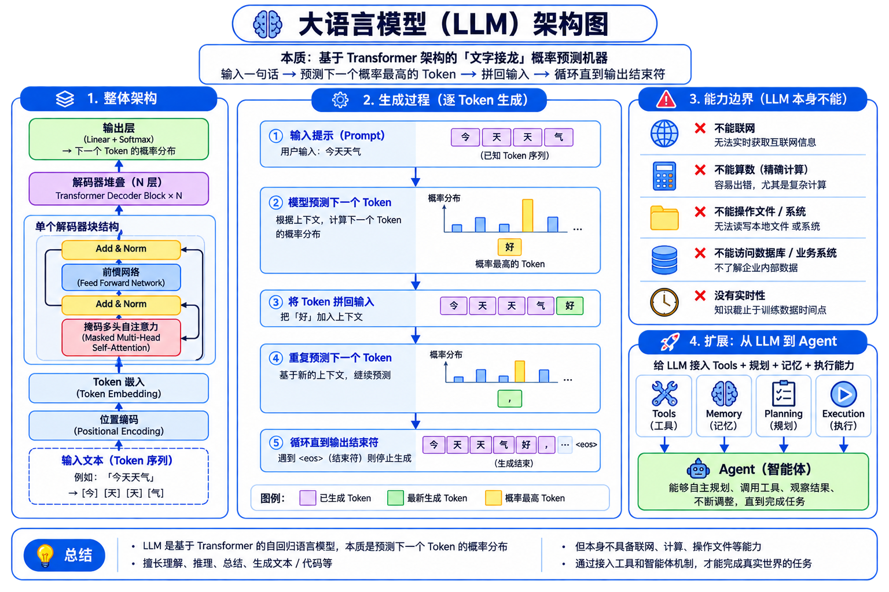
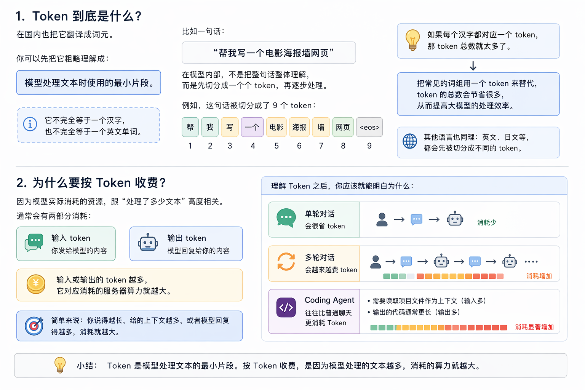
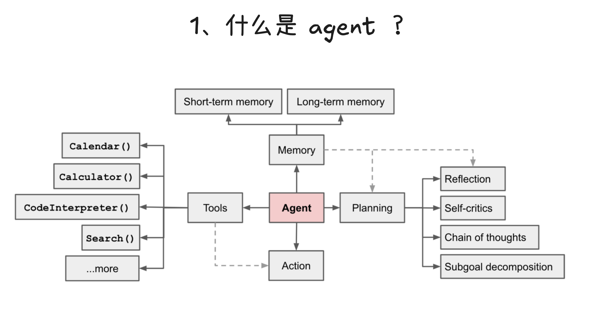
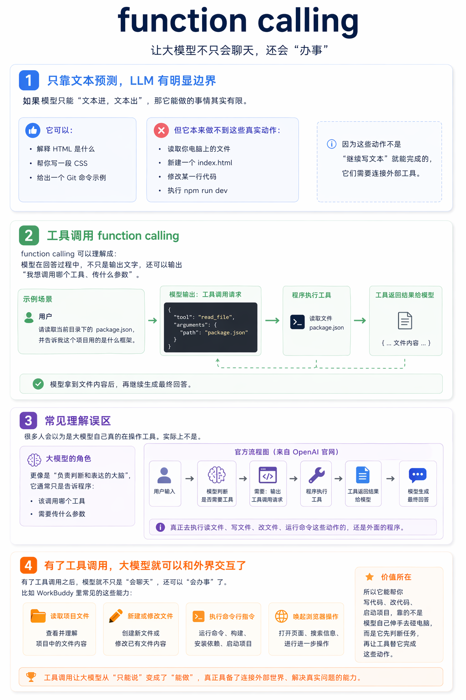
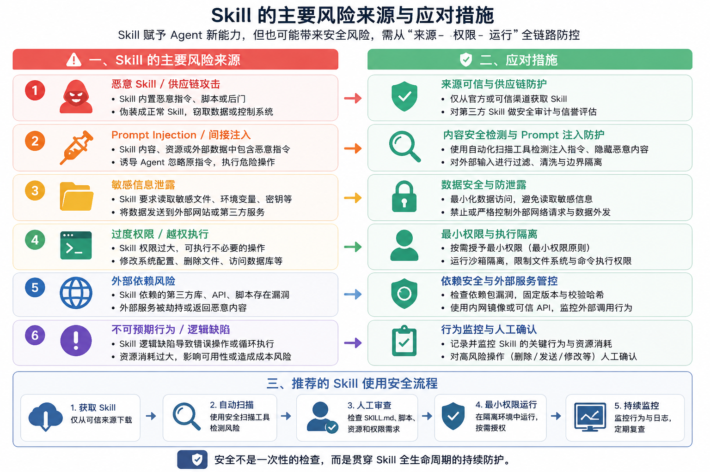

## LLM（Large Language Model）

当前几乎所有大模型的底层引擎都是 **Transformer 架构**。真正把它推向大众的是 OpenAI：2022 年底 GPT-3.5，2023 年 GPT-4 把能力天花板拉到新高度。

本质：一个「**文字接龙**」概率预测机器。输入一句话 → 预测下一个概率最高的 Token → 把该 Token 拼回输入 → 再预测下一个 → 循环直到输出结束符。所以大模型是**逐词生成**的。角色：AI 系统的「大脑」，负责理解、推理、生成文本，但本身**不能联网、不能算数、不能操作文件**。

<div style="page-break-inside: avoid;">



</div>

## Token

大模型处理文本的**最小离散单位**。模型只认识数字、不认识文字，所以中间需要 **Tokenizer（分词器）**做"翻译"：

- **编码**：把文字切成最小片段 → 映射成数字 Token ID → 送入模型做矩阵运算。
- **解码**：模型吐出 Token ID → 映射回文字。

不同 tokenizer 的切分粒度不同。同一段中文，在 GPT（cl100k / o200k）里可能被切成 30 个 token，在 Claude 里可能只有 22 个——这也是各家 API **计费和上下文消耗**的差异来源。

<div style="page-break-inside: avoid;">



</div>

Tokenizer 可视化：<https://tiktokenizer.vercel.app/?model=gpt-4>

## Context & Context Window

**Context**：大模型每次处理任务时「看到」的**全部信息总和** = System Prompt + 历史对话 + User Prompt + 工具返回结果 + 模型正在生成的 Token。相当于模型的**临时记忆体**。大模型本身没有长期记忆，所谓"记得你说过的话"，其实是程序每次调用时把整段对话历史重新发过去。

**Context Window**：Context 能容纳的**最大 Token 数量**。100 万 Token ≈ 150~200 万汉字 ≈ 整部《哈利·波特》全集。

### 为什么 Context 如此重要？

- **决定模型"知道什么"**：放进 Context 的信息，模型能用；没放进的，等于不存在。
- **决定成本与速度**：Context 越长，单次推理的算力和费用越高、响应越慢。
- **决定复杂任务可行性**：让模型读完整本书、跨百轮对话保持一致，依赖大窗口。

### 主流大模型官方上下文窗口对比

下表把 4 家代表性厂商的当前主流窗口列出来。先按"国外 / 国内"分两张小表，避免一张大表被强行拆到两页。

<div style="page-break-inside: avoid;">

**国外主流**

| 模型系列 | 厂商 | 代表型号 | 官方上下文窗口 |
| --- | --- | --- | --- |
| GPT 系列 | OpenAI | GPT-5 / GPT-5 Mini / GPT-5 Nano | 400K tokens（GPT-4.1 系列可达 1,047,576） |
| Claude 系列 | Anthropic | Claude Opus 4 / Sonnet 4 | 200K tokens（Opus 5 / Sonnet 5 / Fable 5 达 1M） |

</div>

<div style="page-break-inside: avoid;">

**国内主流**

| 模型系列 | 厂商 | 代表型号 | 官方上下文窗口 |
| --- | --- | --- | --- |
| DeepSeek 系列 | 深度求索 | DeepSeek-V3 / R1（开源权重） | 128K tokens（部署可通过 MAX_MODEL_LEN 配置） |
| Kimi 系列 | 月之暗面（Moonshot AI） | Kimi K2 / K2.6 / K2.7 | 256K tokens（消费端"200K 汉字长文本"著称；K3 达 1M） |

</div>

### 趋势观察（2024 → 2026）

- **2024 年主流窗口**：128K–200K，旗舰模型标配。
- **2025–2026 年**：400K–1M 成为新旗舰门槛，1M 窗口已不是孤例。
- **实际可用 ≠ 官方上限**：长上下文下模型注意力会衰减，中间位置的内容最容易被"遗忘"，业界称 *lost in the middle*。
- **计费与窗口解耦**：多数厂商按"输入 + 输出"分档计费，长上下文输入的单价通常高于短输入。

### Context Engineering

**定义**：有意识地挑选、组织、压缩、更新 context。目标是在有限窗口里放入**最相关、最可靠、最可执行**的信息。

**五大核心原则**：

1. **优先级排序**：关键指令 > 必要上下文 > 补充信息；不要把全部信息一股脑塞进去。
2. **结构化表达**：分点、分段、列表 > 大段连续文本；给模型明确的"骨架"远比给一堵文字墙有效。
3. **压缩与摘要**：用摘要代替原文，用引用代替全量；让模型按需取用，而不是预先全量加载。
4. **隔离与分轮**：长任务拆成多轮短任务；把"无关上下文"从主对话里剥离出去。
5. **动态更新**：滚动摘要、关键事实重写、工具结果精简——别让陈旧信息占着窗口。

## Prompt（提示词）

给大模型的「具体指令 / 问题」。分两类：

- **User Prompt（用户提示词）**：用户在前台输入的具体问题或需求。
- **System Prompt（系统提示词）**：开发者在后台预设的「人设 + 做事规则 + 输出格式」，对话开始时注入，持续影响模型行为（用户通常看不到）。

**写好 Prompt 的 4 个底层技巧**：

- **明确角色与目标**：让模型知道"你是谁、为谁、产出什么"。
- **给出输入与约束**：格式（列表 / 表格 / JSON）、字数、风格、可引用的资料范围。
- **示范（Few-shot）**：给 1-3 个正/反例，比抽象描述有效 10 倍。
- **校验与回退**：要求模型先列步骤再产出，或在不确定时反问，避免"自信地胡说"。

## Agent（智能体）

以 LLM 为核心，具备 **规划（Planning）+ 记忆（Memory）+ 工具使用（Tool Use）+ 反思（Reflection）** 的自主系统。

与「普通对话」的区别：普通对话一问一答、被动响应、只产文本；Agent 多轮迭代、主动拆解任务、自己选工具、能操作外部系统。

**典型流程**：接收目标 → 理解（LLM）→ 规划步骤 → 调 Tool / MCP → 获结果 → 再推理 → 直到任务完成。

**Agent 的 4 大能力支柱**：

- **规划**：把模糊目标拆成可执行步骤，并能根据反馈重排。
- **记忆**：短期（本次会话 context）+ 长期（向量库 / 文件 / 数据库）。
- **工具**：决定"什么时候调、调哪个、传什么参数"。
- **反思**：执行后自我评估，发现错误就回滚或换路径。

<div style="page-break-inside: avoid;">



</div>

## Tool（工具 / Function Calling）

外部函数 / API（查天气、搜网页、跑代码、读文件等）。模型**不亲自执行**，而是输出一段结构化调用指令（JSON）→ 宿主程序执行 → 结果回传模型 → 模型生成最终回答。

**流程**：用户提问 → 平台转发（附工具列表）→ 模型判断要调工具 → 输出调用指令 → 平台执行 → 返回结果 → 模型整理成自然语言。

### 为什么需要 Function Calling？

LLM 本身只能"文本进、文本出"，有三大边界：**没有实时数据**（不知道今天的天气、股价）、**不能操作系统**（发不出邮件、改不了数据库）、**数学不靠谱**（复杂计算容易算错）。Function Calling 就是给 LLM 装上"手和脚"，让模型从"聊天搭子"升级为"能办事的助手"。

### 一个完整的 JSON 调用示例

以"查询杭州天气"为例，模型会按工具的 schema 输出这样一段结构化调用：

```json
{
  "name": "get_weather",
  "arguments": {
    "location": "杭州",
    "unit": "celsius"
  }
}
```

宿主程序拿到这段 JSON，去执行真正的天气 API，再把结果（如 `{ "temp": 28, "humidity": 65 }`）回传给模型，模型再生成"杭州现在 28℃，湿度 65%，挺闷热的"这种自然语言回答。

### 工作流程的 5 个关键节点

1. **工具注册**：开发者预先定义可用工具的 name / description / parameters（JSON Schema）。
2. **意图识别**：模型根据工具描述判断"这个任务要不要调工具、调哪个"。
3. **参数生成**：模型按 schema 严格输出 JSON 参数（参数错了整个调用就废了）。
4. **执行回调**：宿主程序执行（可能成功 / 失败 / 超时），把原始结果回传。
5. **结果整合**：模型把工具结果"翻译"成自然语言，并决定是否需要再调一次工具（多轮调用）。

<div style="page-break-inside: avoid;">



</div>

### 典型应用场景

- **信息检索**：搜索网页、抓取新闻、查企业内部数据库。
- **系统操作**：发送邮件 / 短信、创建工单、改数据库记录。
- **数据处理**：解析 PDF / Excel、生成图表、批量重命名文件。
- **硬件控制**：智能家居指令、IoT 设备联动、机器人动作。
- **业务编排**：电商下单、机票预订、日历排会、报销审批。
- **开发辅助**：跑代码、查文档、提交 PR、执行 SQL。

### 最佳实践

- **工具描述要"人话"**：description 写得越清晰具体，模型挑对工具的概率越高。
- **参数 schema 严格化**：用 JSON Schema 限定类型、枚举、必填项，减少"幻觉参数"。
- **错误处理要做厚**：超时、限频、空结果都要有兜底回退，模型才知道下一步怎么走。
- **并行与串行组合**：相互独立的工具可以并发调，有依赖关系的必须串行。

## MCP（模型上下文协议 / Model Context Protocol）

Anthropic 提出的**标准化工具连接协议**，统一了 LLM 客户端与外部数据源 / 工具的对接方式。类比：AI 工具生态的 **USB / Type-C 接口**——写一个 Tool Server，任意支持 MCP 的 Client（Claude Desktop、Cursor 等）即插即用。

**MCP vs Function Calling 的关系**：MCP 不是替代 Function Calling，而是**统一工具接入的协议**。开发者写一次 MCP Server，所有支持 MCP 的客户端都能用；不需要每个客户端单独适配。Function Calling 仍是"模型如何决定调工具"，MCP 是"工具如何被暴露给模型"。

<div style="page-break-inside: avoid;">


</div>

MCP 公开社区：<https://www.modelscope.cn/mcp>

MCP 在线体验：<https://www.mcpplayground.tech/?utm_source=chatgpt.com>

## Skill

### 是什么

Skill 是"装在 Agent 身上"的专项能力包：一个文件夹里装指令、脚本、参考资源，Agent 在合适场景下**动态加载**并应用。类比：MCP 是"通用 USB 接口"，Skill 则是"插上去之后具体怎么用的说明书"。

[Equipping agents for the real world with Agent Skills](https://www.anthropic.com/engineering/equipping-agents-for-the-real-world-with-agent-skills?utm_source=chatgpt.com)

### 去哪里找

- [anthropics/skills 仓库](https://github.com/anthropics/skills/tree/main/skills)
- [skills.sh](https://www.skills.sh/)
- [clawhub.ai](https://clawhub.ai/)

### Skill 风险

Skill 看起来只是一个 Markdown 文件，但它不是普通文档——它会改变 Agent 的行为，甚至可能携带代码、工具调用和数据访问能力。任何注册 Github 的用户均可上传 skill，Anthropic 明确提醒，恶意 Skill 可以指导 Agent 执行任意代码、访问敏感文件、向外部发送数据。研究表明，**26.1%** 的技能存在漏洞，**5.2%** 的技能可能存在恶意意图，带有可执行脚本的 Skill，发现有漏洞的概率比普通的要高出 **2.12** 倍。

**使用 Skill 的 3 条安全建议**：

1. **来源可信**：只安装官方仓库或社区口碑良好的 Skill，不要随便装来路不明的。
2. **先审计再启用**：通读 SKILL.md 与附带脚本，确认没有可疑的 `curl` / `exec` / 文件外发。
3. **最小权限**：给 Agent 运行时限定工作目录、网络出口和可调用的工具范围。

<div style="page-break-inside: avoid;">



</div>

[skillspector（NVIDIA 安全扫描工具）](https://github.com/nvidia/skillspector)

## 总结

**一句话区分**：

- **Skills** 说"**该怎么做**"，**Projects** 说"**需要知道什么**"。
- **MCP** 管"**连上数据**"，**Skills** 管"**拿到数据后怎么处理**"。
- 真正强的智能体 = 这五样按需组合，而不是只押注一种。

## 拓展阅读 & 资料来源

- [Skills explained: How Skills compares to prompts, Projects, MCP, and subagents](https://claude.com/blog/skills-explained)
- [Equipping agents for the real world with Agent Skills（Anthropic Engineering）](https://www.anthropic.com/engineering/equipping-agents-for-the-real-world-with-agent-skills?utm_source=chatgpt.com)
- [Model Context Protocol 官方文档](https://modelcontextprotocol.io/)
